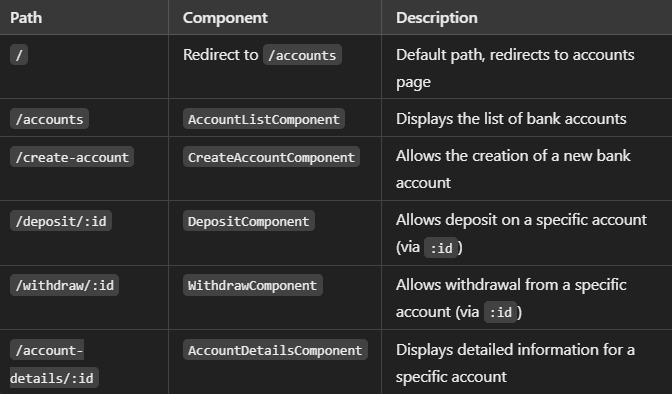

# Frontend for Banking System

This Angular project provides a web-based interface for managing banking operations, including account creation, deposits, withdrawals, and account details. The application connects to a Spring Boot backend to handle business logic and data persistence. The frontend allows users to perform various banking tasks securely and efficiently.

## Table of Contents

- [Features](#features)
- [Live Demo](#live-demo)
- [Getting Started](#getting-started)
- [Routing Structure](#routing-structure)
- [Backend Setup](#backend-setup)
- [Development](#development)
- [Testing](#testing)
- [Built With](#built-with)
- [Contributing](#contributing)

## Features

- **Account Management**: Create, view, and update bank accounts
- **Deposits and Withdrawals**: Make deposits and withdrawals on specific accounts
- **Account Details**: View detailed account information
- **Routing Setup**: Seamless navigation between different components
- **Role-Based Access**: Admin and user roles with restricted access to certain features

## Live Demo

Check out the live demo of the application: [Banking System Demo](https://your-demo-link-here)

## Getting Started

### Prerequisites

- Spring Boot (backend)
- Angular CLI
- Node.js

#### Backend (Spring Boot)

Ensure you have a Spring Boot application running as the backend. Follow the [backend setup instructions](#backend-setup).

#### Frontend (Angular)

Install Angular CLI:

```bash
npm install -g @angular/cli
```

## Installation

Clone the repository
To clone the repository to your local machine:

1. Copy the repository URL from GitHub.
2. Open a terminal and run the following command:

```bash
git clone https://github.com/<your-username>/banking-system-frontend.git
```

3. Navigate into the project directory:

```bash
cd banking-system-frontend

```

## Install Frontend Dependencies

To install the required dependencies for the frontend project:

```bash
npm install
```

## Routing Structure



## Development

Development Server

```bash
ng serve
```

Runs the app in development mode at http://localhost:4200

## Code Scaffolding

Generate new components:

```bash
ng generate component component-name
```

## Build

```bash
ng build
```

Builds the application for production in dist/ directory

## Testing

### Unit Tests

```bash
ng test
```

Runs Karma test runner

### End-to-End Tests

```bash
ng e2e
```

_Note: Requires configuration of preferred E2E testing framework_

## Built With

1. Angular 19.1.7
2. Angular Router
3. TypeScript
4. RxJS

## Contributing

1. Fork the repository
2. Create your feature branch (git checkout -b feature/new-component)
3. Commit changes (git commit -m 'Add new component')
4. Push to the branch (git push origin feature/new-component)
5. Open a pull request

```bash
This structure provides:
- Clear feature overview
- Quick start instructions
- Detailed routing documentation
- Standard Angular development workflows
- Contribution guidelines
- Visual organization with tables and code blocks

You can customize the [Built With] section to include any additional libraries or tools used in your project.
```
